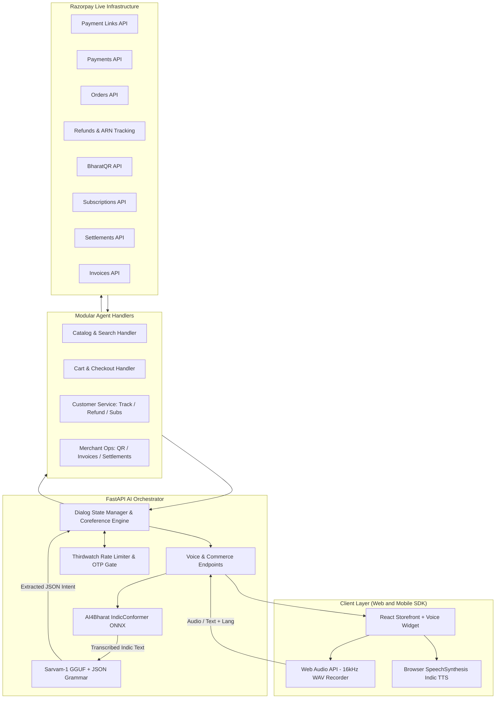

# Indic Multilingual Voice AI Agent for Razorpay

[](https://python.org)
[](https://fastapi.tiangolo.com)
[](https://react.dev)
[](https://razorpay.com)
[-FF6F00.svg?style=flat-square)](https://sarvam.ai)
[-4CAF50.svg?style=flat-square)](https://ai4bharat.iitm.ac.in)

Razorpay AI Buildathon 2026 Submission  
Track 01: AI Growth & Agentic Commerce  

An end-to-end, edge-accelerated conversational commerce and merchant operations engine powered by Indic speech recognition, contextual LLM intent extraction, and real-time Razorpay financial APIs.

---

## 1. Executive Summary

In India's digital economy, the next 500 million internet users (Next Billion Users) prefer speaking in their regional language rather than typing in English.

This Voice AI Assistant bridges this literacy and language barrier through a dual-engine architecture:
1. **Consumer Voice Commerce:** Vernacular voice search, product comparison, dynamic cart management, and one-click Razorpay payment link checkout.
2. **Autonomous Merchant Desk:** Voice-activated refund processing, BharatQR generation, settlement auditing, GST invoice creation, and subscription management.
3. **Bank-Grade Safety & Thirdwatch Gating:** Financial and money-movement actions are intercepted behind an OTP confirmation gate and sliding-window fraud rate limiter.
4. **Real-Time Razorpay API Execution:** Direct interface with live Razorpay endpoints for payments, orders, payment links, refunds, and acquirer tracking with zero mock fallbacks for live operations.

---

## 2. Buildathon Track 01 Alignment: AI Growth & Agentic Commerce

This Voice AI Assistant is designed to fulfill the problem statement, technical scope, and evaluation rubric of **Track 01: AI Growth & Agentic Commerce** at the Razorpay AI Buildathon 2026.

### 2.1 Track Problem Statement
> *"Grow the merchant's revenue, and make them sellable to AI buyers. Build an agent that grows revenue for a merchant on Razorpay test-mode APIs, or that makes a merchant transactable by an AI buyer end to end."*

### 2.2 Macro Industry Context: Why Now?
- **NPCI Unified Application Protocol (UAP):** India's digital payment ecosystem is transitioning from manual app-driven checkouts to protocol-driven agentic transactions.
- **Global Agentic Commerce Protocols:** Initiatives like Agentic Commerce Protocol (ACP), Agent Payment Protocol (AP2), and HTTP 402 machine payment standards (x402) are establishing autonomous purchasing standards.
- **Razorpay Integration:** By creating structured, machine-transactable catalog schemas alongside real-time Razorpay checkout links, the Voice Agent enables merchants to sell simultaneously to vernacular human voice shoppers and autonomous AI purchasing agents.

### 2.3 Example Directions Addressed

| Track 01 Direction | Voice Agent Implementation | Impact on Merchant Growth |
|---|---|---|
| **Conversational In-App Checkout** | Multilingual speech-to-text (AI4Bharat IndicConformer) + local NLU (Sarvam-1 GGUF) + dynamic cart engine + real-time Razorpay Payment Link generation (`plink_...`). | Overcomes regional language barriers; reduces checkout drop-off and cart abandonment. |
| **Agent-Readable Catalog** | Structured catalog schema (`inventory.json`), fuzzy phonetic search, real-time inventory quantity tracking, and JSON API serialization. | Enables instant product discovery by both human voice buyers and autonomous software agents. |
| **Upsell & Cross-Sell Agent** | Recommends complementary products upon cart additions (`get_cross_sell()`) and substitutes for out-of-stock items (`suggest_alternative()`). Multi-turn affirmation ("हाँ वो जोड़ दो" / "ಹೌದು, ಸೇರಿಸಿ") dynamically converts recommendations into cart items. | Increases Average Order Value (AOV) and prevents lost sales due to depleted inventory. |
| **Merchant Financial Operations Desk** | Voice-driven generation of on-demand BharatQR codes (`qr_code.create()`), GST invoices (`invoice.create()`), settlement status checks (`settlement.all()`), and subscription management (`subscription.cancel()`). | Reduces operational overhead for small merchants managing payments, reconciliations, and refunds. |

### 2.4 Compliance with "The Bar" (Evaluation Rubric)

The Buildathon guidelines define three non-negotiable criteria for Track 01 projects:

#### Criterion 1: Every Money Action Explainable, Bounded, and Gated
- **Zero Autonomous Financial Execution:** No money movement action (payment link generation, refund trigger, subscription cancellation, QR generation) can execute without customer consent.
- **Interactive OTP Confirmation Gate:** When a financial action is detected, the agent transitions into a `pending_confirmation` state, halts execution, and requires the user to explicitly confirm ("Yes, confirm" / "हाँ, कर दो" / "ಹೌದು, ಖಚಿತಪಡಿಸಿ") before invoking any Razorpay financial API.
- **Thirdwatch Sliding-Window Rate Limiting:** Implements a sliding-window rate limiter (capped at 15 financial requests per 60 seconds per user session) to guard against velocity abuse, bot loops, and automated financial drain.

#### Criterion 2: Complete Audit Trail
- **Structured Turn-by-Turn Logging:** Every session interaction produces timestamped audit records (`[AUDIT]`, `[CONFIRM]`, `[AGENT]`).
- **Live Razorpay Identifiers:** Every completed transaction returns official Razorpay entity identifiers (`plink_...`, `pay_...`, `rfnd_...`, `order_...`).
- **Direct Receipt & Dashboard Links:** Agent responses embed direct links to the official Razorpay Merchant Dashboard (`https://dashboard.razorpay.com/app/payments/...`, `/refunds/...`, `/orders/...`), providing instant external verification.

#### Criterion 3: Failures Handled Gracefully
The agent implements multiple failure recovery mechanisms:
- **Out of Stock Failure:** If a requested item has zero stock, the agent does not fail; it explains the stock shortage and recommends an in-stock alternative in the same product category.
- **Empty Cart Checkout Attempt:** If a user requests checkout on an empty cart, the agent blocks payment link creation, informs the user, and suggests browsing the catalog.
- **Bank Network Timeout / Payment Failure:** The `handle_failed_payment` handler detects timeout errors and offers recovery links to tokenized cards (TokenHQ).
- **Refund Balance Protection:** The `_resolve_payment_id()` engine verifies captured payment states and remaining unrefunded balances prior to invoking `client.payment.refund()`, preventing 400 Bad Request errors.

---

## 3. Architecture and Technology Stack



### Indic Automatic Speech Recognition (ASR)
- **Model:** AI4Bharat IndicConformer (INT8 quantized ONNX models).
- **Supported Languages:** Hindi (`hi`), Kannada (`kn`), Tamil (`ta`), Telugu (`te`), Marathi (`mr`), Malayalam (`ml`), and English (`en`).
- **Processing Pipeline:** Audio captured through the Web Audio API is downsampled and normalized in-browser to single-channel 16kHz PCM WAV format, yielding sub-250ms transcription latency on standard CPU environments.

### Indic NLU and Intent Extraction
- **Model:** Sarvam-1 (2B Parameters), quantized in Q4_K_M GGUF format for high-throughput local CPU inference via `llama-cpp-python`.
- **Grammar Constrained Decoding:** Constrained via BNF/JSON Grammar rules, enforcing valid schema generation matching backend Pydantic models.
- **Contextual Dialog Memory:** Maintains state across conversation turns to resolve multi-turn coreferences:
  - Example: "हा कर दो" ("Yes, do that") dynamically resolves to pending upsell or alternative products suggested by the catalog handler.
  - Example: "रिफ़ंड करो" ("Refund it") automatically resolves to the latest paid order or payment link in the user session.

### Safety, Fraud Gating, and Thirdwatch Simulation
- Monetary operations (payment link creation, refund execution, vendor payouts, subscription cancellation) require confirmation before API execution.
- **OTP Gate:** Suspends execution in a `pending_confirmation` state until the customer confirms.
- **Sliding-Window Rate Limiting:** Limits financial requests to 15 per minute per session key to mitigate automated abuse.

### Real-Time Razorpay API Integration Engine
- **Payment Link Generation:** Creates standard Razorpay payment links (`https://rzp.io/i/...`) containing transaction amounts, product descriptions, and customer contact data.
- **Automatic Payment ID Resolution (`_resolve_payment_id`):** Resolves underlying payment entities across `plink_...` (payment links), `order_...` (orders), and receipts to execute refunds against verified captured payments (`pay_...`).
- **Live Refunds and ARN Tracking:** Executes partial and full refunds via `client.payment.refund()`, returning acquirer reference numbers (ARN) directly from Razorpay.
- **Dynamic BharatQR:** Issues on-demand BharatQR codes with automated expiry for counter and UPI transactions.
- **Merchant Audits:** Queries recent settlements, account balances, and automated subscription status directly from the Razorpay API.

---

## 4. Project Structure

```
razorpay/
├── backend/
│   ├── agent/                      # Core agent logic and execution
│   │   ├── __init__.py
│   │   ├── dialog_manager.py       # State machine, coreference and intent routing
│   │   └── handlers.py             # Catalog, Cart, Customer Service, and Merchant handlers
│   ├── ai/                         # Machine learning pipelines
│   │   ├── __init__.py
│   │   ├── asr_pipeline.py         # AI4Bharat ONNX ASR loader and transcriber
│   │   ├── intent_pipeline.py      # Sarvam-1 GGUF loader with grammar constraints
│   │   └── prompts.py              # System prompts and few-shot Indic examples
│   ├── asrassets/                  # Multilingual ONNX weights and token vocabularies
│   │   ├── hi/ (model.int8.onnx, tokens.txt)
│   │   ├── kn/ ...
│   │   └── ta/, te/, mr/, ml/
│   ├── models/                     # Data contracts and Pydantic schemas
│   │   ├── __init__.py
│   │   └── schemas.py              # ExtractedIntent, AgentResponse, Session models
│   ├── services/                   # External service wrappers and state
│   │   ├── __init__.py
│   │   ├── inventory_service.py    # Catalog fuzzy matching, stock, and suggestions
│   │   ├── razorpay_service.py     # Live Razorpay SDK client and payment resolution
│   │   └── session_service.py      # Multi-user session store and rate limiter
│   ├── tests/                      # Automated regression and end-to-end tests
│   │   ├── __init__.py
│   │   └── test_agent_suite.py     # Test scenarios covering all supported intents
│   ├── checkout_agent.py           # Top-level execution entrypoint
│   ├── inventory.json              # Store catalog with pricing, stock, and specifications
│   ├── main.py                     # FastAPI REST and Webhook server
│   ├── requirements.txt            # Python dependencies
│   ├── sarvam-1.Q4_K_M.gguf        # Quantized Indic LLM
│   └── .env                        # Razorpay API credentials (excluded from git)
├── frontend-react/                 # Customer storefront interface
│   ├── src/
│   │   ├── components/
│   │   │   └── RazorpayAgent.jsx   # Voice assistant widget with audio recorder
│   │   ├── App.jsx                 # Storefront catalog, cart badge, and layout
│   │   ├── App.css                 # Interface styling
│   │   └── main.jsx
│   ├── package.json
│   └── vite.config.js
├── .gitignore                      # Root gitignore rules
└── README.md                       # Documentation
```

---

## 5. Installation and Setup

### Prerequisites
- Python 3.10 or higher (Python 3.11 or 3.12 recommended)
- Node.js 18 or higher and npm
- A Razorpay account with Test Mode API credentials

### Step 1: Clone Repository and Configure Environment

```bash
git clone https://github.com/ashb155/razorbuild.git
cd razorbuild
```

Create `backend/.env`:
```env
RAZORPAY_KEY_ID=rzp_test_YOUR_KEY_ID
RAZORPAY_KEY_SECRET=YOUR_KEY_SECRET
```

### Step 2: Install Backend Dependencies

```bash
cd backend
pip install -r requirements.txt
```

Verify that `sarvam-1.Q4_K_M.gguf` is present in `backend/`. If tracking with Git LFS:
```bash
git lfs pull
```

### Step 3: Start the Backend Server

```bash
python main.py
```
The FastAPI backend runs at `http://127.0.0.1:8000`.
- Swagger documentation: `http://127.0.0.1:8000/docs`
- Health check: `http://127.0.0.1:8000/`

### Step 4: Install and Start the Frontend

In a separate terminal:
```bash
cd frontend-react
npm install
npm run dev
```
The application runs at `http://localhost:5173`.

---

## 6. Supported Voice Commands and Workflows

The assistant supports full multilingual interaction across Hindi, Kannada, and English (with underlying ASR support for Tamil, Telugu, Marathi, and Malayalam). The demonstration video showcases both Kannada and Hindi voice commerce in real time.

### Customer Shopping and Catalog Search
| Utterance (Kannada) | Utterance (Hindi / Hinglish) | Utterance (English) | Action Taken |
|---|---|---|---|
| "ಬಿಳಿ ಸ್ನೀಕರ್‌ಗಳ ಬೆಲೆ ಎಷ್ಟು?" | "सफेद स्नीकर्स की कीमत क्या है?" | "What is the price of white sneakers?" | Performs fuzzy catalog lookup; returns price and availability. |
| "ಕೆಂಪು ಶೂಗಳನ್ನು ಕಾರ್ಟ್‌ಗೆ ಸೇರಿಸಿ" | "लाल जूते कार्ट में जोड़ दो" | "Add red shoes to my cart" | Identifies out-of-stock item; suggests available alternative. |
| "ಹೌದು, ಅದನ್ನು ಸೇರಿಸಿ" | "हाँ, वो जोड़ दो" | "Yes, add that" | Resolves coreference against pending suggestion and updates cart. |
| "ಕಪ್ಪು ಜಾಕೆಟ್ ತೆಗೆದುಹಾಕಿ" | "काली जैकेट हटा दें" | "Remove black jacket from cart" | Removes item and recalculates cart total. |

### Checkout and Confirmation Gate
1. **User Voice Input:**
   - Kannada: "ನನಗೆ ಚೆಕ್‌ಔಟ್ ಮಾಡಬೇಕು"
   - Hindi: "मुझे चेकआउट करना है"
   - English: "I want to checkout"
2. **Agent Response:** 
   > "Your cart has 1x Samsung Galaxy M14 5G. Total: Rs 14999. Confirm to generate your secure Razorpay payment link?"
3. **User Confirmation:**
   - Kannada: "ಹೌದು, ಖಚಿತಪಡಿಸಿ"
   - Hindi: "हाँ, कर दो"
   - English: "Yes, confirm"
4. **Agent Action:** Generates an active Razorpay payment link (`https://rzp.io/i/...`) and renders a clickable payment redirect button.

### Refund Processing and Bank Tracking
1. **User Voice Input:**
   - Kannada: "ನನಗೆ ಮರುಪಾವತಿ ಬೇಕು"
   - Hindi: "मुझे रिफ़ंड करना है"
   - English: "Refund my order"
2. **Agent Response:** 
   > "This action requires money movement. Initiating OTP Gate... Please confirm before we trigger the Razorpay API."
3. **User Confirmation:**
   - Kannada: "ಹೌದು" / "ಖಚಿತಪಡಿಸಿ"
   - Hindi: "हाँ, रिफ़ंड करो"
   - English: "Yes, confirm"
4. **Agent Action:** 
   - Resolves the underlying payment entity from the session order or payment link.
   - Calls `client.payment.refund()`.
   - Returns confirmation with live refund ID (`rfnd_...`) and Razorpay Dashboard receipt link.
5. **User Tracking:**
   - Kannada: "ಮರುಪಾವತಿ ಸ್ಥಿತಿ ತಿಳಿಸಿ"
   - Hindi: "रिफ़ंड का स्टेटस क्या है?"
   - English: "Track refund status"
6. **Agent Response:** Retrieves live status and bank Acquirer Reference Number (ARN) directly from Razorpay.

### Merchant Operations Desk
| Command (Kannada) | Command (Hindi) | Intent | Real Razorpay API Call |
|---|---|---|---|
| "500 ರೂಪಾಯಿಗೆ ಭಾರತ ಕ್ಯೂಆರ್ ರಚಿಸಿ" | "500 रुपये के लिए भारत क्यूआर कोड बनाएं" | `create_qr` | Generates a BharatQR code using `qr_code.create()`. |
| "Acme Corp ಗೆ 5000 ಇನ್ವಾಯ್ಸ್ ಕಳುಹಿಸಿ" | "Acme Corp को 5000 का इनवॉइस भेजें" | `create_invoice` | Creates a GST invoice via `invoice.create()`. |
| "ನನ್ನ ಹಣ ಸೆಟಲ್ ಆಗಿದೆಯೇ?" | "क्या मेरा पैसा सेटल हो गया?" | `check_settlement` | Fetches the latest settlement batch using `settlement.all()`. |
| "ಚಂದಾದಾರಿಕೆ sub_999 ರದ್ದುಮಾಡಿ" | "सब्सक्रिप्शन sub_999 रद्द करें" | `cancel_subscription` | Cancels subscription using `subscription.cancel()`. |
| "ಈ ಶೂಗಳಿಗೆ ಇಎಂಐ ಆಯ್ಕೆ ಇದೆಯೇ?" | "क्या मैं इन जूतों के लिए ईएमಐ ले सकता हूँ?" | `check_emi` | Computes eligible 3, 6, 9, and 12-month installment schedules. |

---

## 7. Security and Privacy

- **Credential Isolation:** `.env` files and API keys are ignored by git to prevent secret leakage.
- **Local On-Premises Inference:** Speech recognition and LLM inference run locally on CPU, ensuring voice and conversational data remain within the host environment.
- **Zero Hallucination Safety:** Financial commands cannot proceed without explicit customer confirmation, mitigating conversational misinterpretation risks.

---

## 8. Testing

Run the automated test suite covering all supported intents and dialog transitions:

```bash
cd backend
python checkout_agent.py
```

To run standard pytest assertions:
```bash
pytest tests/test_agent_suite.py -v
```

---

## 9. Demo Video Walkthrough Highlights

The submission video demonstrates few features of the end-to-end integration:
1. **Multilingual Voice Recognition:** Real-time spoken interactions in both Kannada ("ನನಗೆ ಚೆಕ್‌ಔಟ್ ಮಾಡಬೇಕು") and Hindi ("मुझे रिफ़ंड करना है"), with on-the-fly speech-to-text decoding.
2. **Context-Aware Conversational Commerce:** Voice catalog lookup, alternative suggestions when stock is depleted, and natural affirmative coreference handling ("ಹೌದು, ಸೇರಿಸಿ").
3. **Thirdwatch & Financial OTP Safeguards:** Demonstrates the confirmation gate intercepting financial transactions before calling Razorpay APIs.
4. **Live Razorpay Checkout:** Instant generation of valid Razorpay payment links (`rzp.io`), successful customer checkout in test mode, and dynamic cart status updates.
5. **Real-Time Refunds and ARN Tracking:** Issuing an instant refund on a captured payment, followed by tracking its live `processed` status and bank Acquirer Reference Number (ARN) directly against the Razorpay merchant dashboard.

---

## 10. License

This project is licensed under the MIT License. See [LICENSE](LICENSE) for details.
